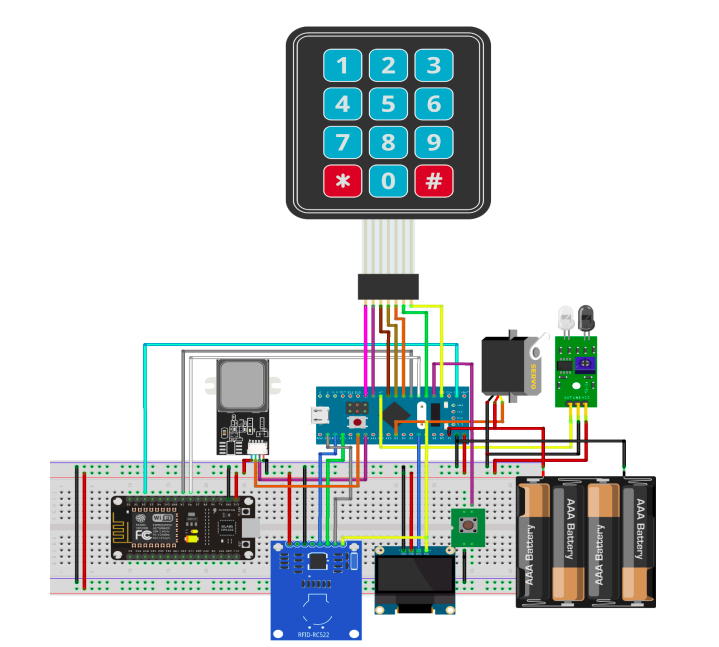
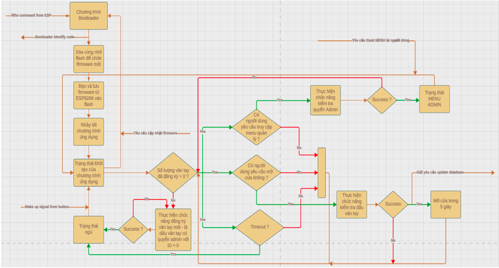
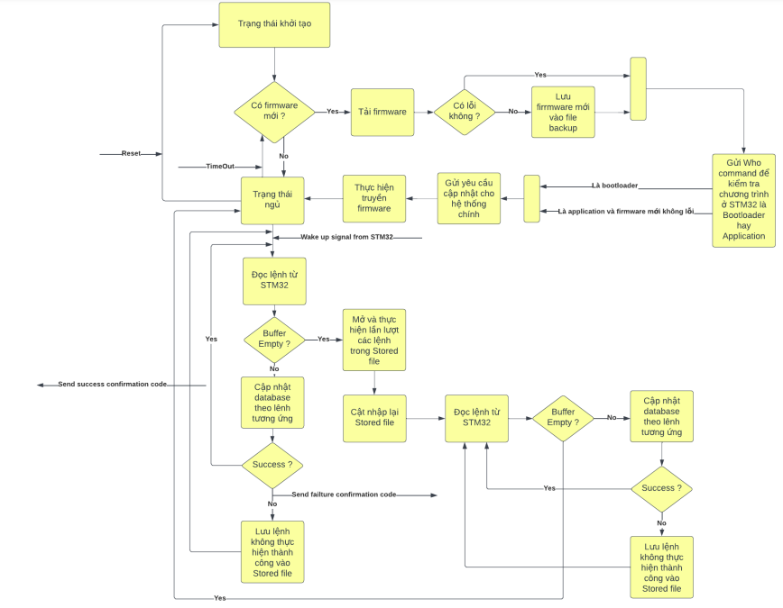

# Introduction
The system is designed to work with fingerprint sensor modules, magnetic card sensors, keyboards, servo motors,
ESP8266 circuit board, Oled screen and STM32F103C8T6 circuit board. System capable of identifying users based 
on passwords, magnetic cards and fingerprints. It controls the Servo for the door opening/closing process, in 
addition it also has other functions such as power saving mode, or the ability to update firmware from far aka FOTA. 

## System Architecture

The System divided into 2 subsystems:

- Major system: Including microcontroller STM32F103C8T6 and peripherals used include: AS608 fingerprint sensor,
    RFID magnetic RC 522 card sensor, 3x4 matrix keyboard module, 0.96 inch oled screen and 5V Servo motor. 
    This system will perform all basic functions. Mainly, the STM32F103C8T6 microcontroller acts as the central microprocessor 
    that controls the system's flow of operations and uses sensors and peripherals to perform system's functions.
    
- Minor System: Only includes the ESP8266 circuit board, this system performs functions required to access and use 
    the Internet such as FOTA, etc. It communicates with the STM32 microcontroller via the UART communication standard, carry 
    out requests sent from the central processor of the entire system and send back the desired results to the main system.

The operation flow of Major and Minor system were illustrated by the flow chart as below:

Flow chart of Major system:

- The main control program starts in the initialization state, during which it sets the operating mode and provides clock signals to the digital communication modules and GPIO pins.
- After initialization and setup are complete, it checks the number of registered fingerprints stored in the flash memory of the STM32 microcontroller.
- If the number of registered fingerprints is greater than 0, the system enters normal operating mode. In the opposite case, the system requires users to register at least one fingerprint – the fingerprint of the manager. The fingerprint database management functions only operate when the manager's fingerprint has been registered.
- In the operational state, when there is a request to unlock the door, the system checks the user's fingerprint. If valid, it controls the servo to rotate and unlock the door, while simultaneously sending a database update request containing the employee's check-in/check-out time to the webserver. The format of the request is as follows:
      “(Character with value 127)|ADDTIME|Context: (ID value)| \nText to translate: (ID value)|(Ký tự newline)”.
- When there is a request to access the ADMIN MENU, the system requires checking the user's card, password, and fingerprint. Only when all three pass can the user use the management function.
- If a certain period of time passes, the system will enter sleep mode and will only wake up when an interrupt occurs at pin A0 – when the user presses the button, the user also uses this button to request access authentication for the ADMIN MENU.
- The system performs the FOTA function through a handshake process with the ESP8266 circuit board via the UART1 communication pins, as follows:
  
    &nbsp; - The system receives the Who request from the ESP8266 through an interrupt from the UART1 module.
  
    &nbsp; - The system sends back a confirmation message for the program on STM32, which is currently an application program.
  
    &nbsp; - If it receives feedback from the ESP8266 that there is a new firmware version and an update is required, the system immediately resets to address 0x0800000 to switch to the Bootloader program's operation flow.
  
    &nbsp; - The Bootloader program continues to receive Who requests from the ESP8266 and responds by confirming that the STM32 is in the Bootloader program.
  
    &nbsp; - The system waits until it receives a START response from the ESP8266 and begins the process of receiving and writing firmware into the flash memory.
  
    &nbsp; - The firmware will be transmitted line by line in HEX format. STM32 reads each line and checks for errors using a 2-byte checksum at the end of each record. If an error is detected, it will request the retransmission of that record.
  
    &nbsp; - If too many errors occur in a single record, the system confirms there is a fault in the physical transmission, at this point, the system will be reset and return to the initial state of the Bootloader program.
  
    &nbsp; - After completing the reading and writing of firmware into the flash memory designated for the application program, the Bootloader will perform the procedure to jump to the recorded application program. This includes resetting the PC pointer and vector table to the address of the new program, disabling the clock source of the peripherals, etc.

Flow chart of Minor system:

- The auxiliary system will handle the Internet-related functions of the system, including performing FOTA as well as updating the database on the Webserver whenever there is a request from STM32.
- The auxiliary system starts in the initialization state, during which it initializes and sets up the operation for the modules needed by the system.
- Then, it checks for the latest firmware version on the system by sending an HTTP GET request to the NewVersion file on the webserver, and then compares it with the current version of the system, which is also stored in another file on the system. If there is, it will continue to perform an HTTP GET to download the firmware content saved in HEX format, the firmware file will be saved to a temporary file and then checked for errors. If there are no errors, it will be recorded into the backup file and then the system will perform the handshake procedures for the firmware transmission process. After completing the transmission process, the auxiliary system enters sleep mode.
- In sleep mode, the system's Wifi and Bluetooth modules stop functioning, and the CPU's operation is temporarily blocked. The system will only wake up when a negative edge signal pulse on GPIO4 is sent from STM32 or when the sleep time has elapsed. The CPU will start operating again from the line after the sleep function.
- When there is a wake-up signal, the system will check the UART receive buffer to read and process the database update commands sent from STM32. The commands that it cannot process – if the cause is not due to syntax errors or faulty information, will be saved in the Stored file so that they can be re-executed at the next wake-up.
- After processing the current requests, it reopens the Stored file to sequentially handle the requests that were not completed, and the successfully processed requests will be deleted.
- Finally, the system will check the UART receive buffer again to see if there are any requests during the process of handling the Stored file. If not,
it goes back into sleep mode.
- The system will check the firmware version each time it is reset or when it wakes up after the sleep period.
## More

To understand more deeply about the system, you coud check my report attached at Document folder: https://github.com/TranNamCHY/SmartLock/tree/main/Document
